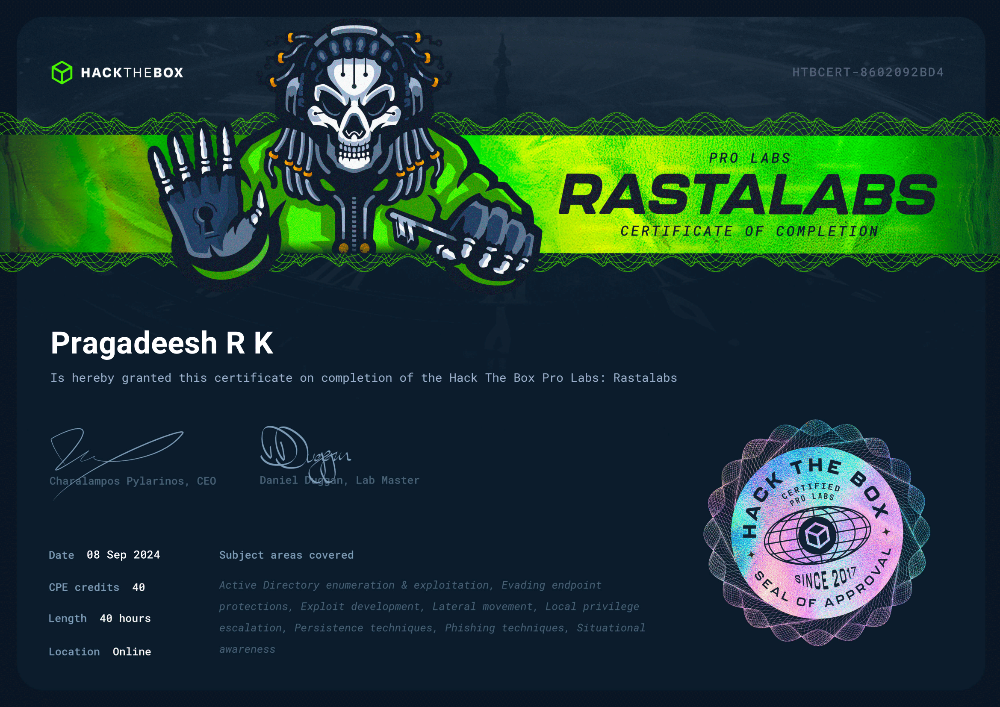

## Quick Links
- [Home](./index.md)
- [CRTO Review](./CRTOREVIEW.md)
- [CPTS Review](./CPTSreview.md)
- [C2-ServerProject](./c2-ServerProject.md)
- [davinc-projects](./davinc-projects.md)
- [Contact Me](./contact.html)

# ProLabs Review

## RastaLabs Overview

RastaLabs provides a realistic simulation of a corporate IT environment, primarily utilizing **Microsoft Windows** systems. The lab encompasses various elements such as **Active Directory (AD)**, **Exchange**, **SQL Server**, and **IIS**, along with **Windows 10** workstations, all spread across multiple subnets.

### Prerequisites

To get the most out of RastaLabs, you should have a solid grasp of **red teaming** or **penetration testing**, as well as experience with **security administration** within an Active Directory setup. Proficiency in **PowerShell scripting** and AD exploitation techniques is highly recommended.

### Lab Highlights

RastaLabs is designed to test your ability to infiltrate a network where traditional exploits are ineffective due to up-to-date **anti-virus defenses**. The focus is on **strategic infiltration** and moving laterally across the network, with the ultimate goal of achieving **Domain Admin** status.

Key aspects covered include:

- **Social Engineering & Phishing** attacks
- Advanced **PowerShell** usage
- **Active Directory enumeration** and exploitation
- **Lateral movement** techniques
- **Kerberos** attacks
- Persistence and **privilege escalation**

RastaLabs stands out for its ongoing updates, ensuring that the challenges remain relevant and engaging. It’s an excellent lab for developing a deep understanding of Windows AD environments and offensive security strategies.

## APTLabs Overview

APTLabs offers an intricate set of attack paths that reflect real-world corporate security scenarios. The lab is designed to challenge your ability to bypass **modern security defenses** and exploit commonly used technologies in **Red Team** operations.

### Prerequisites

While APTLabs does not feature an active **Blue Team** defending against your attacks, you’ll still face various **security features** that need to be circumvented. Familiarity with **Command and Control (C2)** frameworks like **Cobalt Strike** or **Covenant** is advantageous for maintaining persistence and managing your attacks.

### Lab Highlights

In APTLabs, you’ll encounter a range of sophisticated security measures that mirror those found in real-world environments. Although there is no direct defensive team, you will need to handle:

- Various **modern security features** that require effective bypass techniques
- The use of **C2 frameworks** for effective command and control
- Regular **lab resets**, which require efficient re-attack strategies to progress

Despite the challenge of lab resets and the absence of a Blue Team, APTLabs offers a stable environment where attacks are generally reliable and repeatable. The lab's focus on practical, real-world attacks makes it a valuable resource for enhancing your Red Teaming skills.

---

